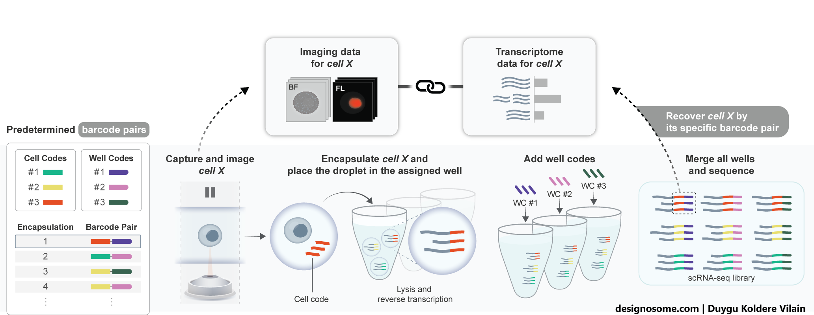

# IRIS

## Overview

This repository accompanies the manuscript disclosing the technology platform for **integrated robotic imaging and sequencing (IRIS)**.

- IRIS provides **paired image <> transcriptome per cell** to perform phenomic studies.  
- The manuscript *(Bues, Pezoldt, Lambert, et al.)* is accessible on [biorxiv](https://www.biorxiv.org/content/10.1101/2025.11.28.690954v1).  
- The **Fastq** and processed sequencing data for scRNA-seq is available at:  
  [GEO: GSE300918](https://www.ncbi.nlm.nih.gov/geo/query/acc.cgi?acc=GSE300918)

---

## Structure

The repository contains:

- **Pre-processing and QC pipeline** for IRIS-derived scRNA-seq data  
  - **[scRNAseq preprocessing](./0_scRNAseq_preprocessing)**

- **Analysis and visualization code** for sections in the manuscript:  
  - **[Benchmarking](./1_scRNAseq_benchmarking)** (Figure 2 & 3)  
  - **[Cell cycle](./2_Cellcycle)** (Figure 4 & 5)  
  - **[T cells](./3_Tcells)** (Figure 6)

- **Miscallaneous(./X_docs)** includes envs, barcodes, functions, expression signatures and illustrations
